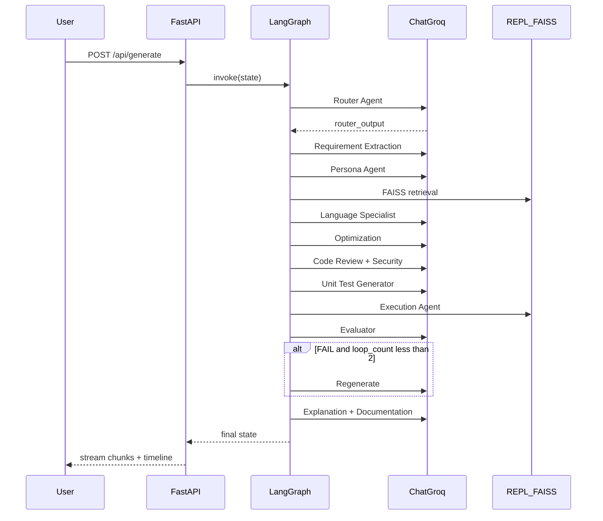
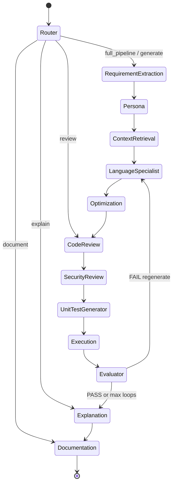

# CodeForge AI — Architecture

## System Overview

CodeForge AI is a persona-driven multi-agent software engineering platform. Natural language requests flow through a LangGraph workflow of 13 specialized agents, orchestrated by a FastAPI backend and visualized in a React dashboard.

```mermaid
flowchart TB
    subgraph frontend [React Frontend]
        UI[Dashboard]
        Monaco[Monaco Editor]
        Timeline[Agent Timeline]
        FlowViz[React Flow Graph]
        APIClient[REST Client]
    end

    subgraph api [FastAPI Backend]
        Routes[REST API]
    end

    subgraph graph [LangGraph Workflow]
        R[Router] --> RE[RequirementExtraction]
        RE --> P[Persona]
        P --> CR[ContextRetrieval]
        CR --> LS[LanguageSpecialist]
        LS --> O[Optimization]
        O --> CRv[CodeReview]
        CRv --> SR[SecurityReview]
        SR --> UT[UnitTestGenerator]
        UT --> EX[Execution]
        EX --> EV[Evaluator]
        EV --> EP[Explanation]
        EP --> DOC[Documentation]
    end

    subgraph services [Services]
        LLM[GroqProvider]
        PromptLoader[Prompt Loader]
        FAISS[FAISS Retriever]
        REPL[Python REPL]
    end

    UI --> APIClient
    APIClient --> Routes
    Routes --> graph
    graph --> services
```

## Request Lifecycle



## State Machine



## Component Responsibilities

| Component | Responsibility |
|-----------|----------------|
| `backend/graph/workflow.py` | LangGraph StateGraph compilation and conditional edges |
| `backend/agents/` | 13 agent node implementations |
| `backend/prompts/loader.py` | Load and inject Markdown prompt templates |
| `backend/services/llm.py` | Groq LLM provider with per-agent model routing |
| `backend/tools/repl.py` | Sandboxed Python execution |
| `backend/tools/retriever.py` | FAISS vector retrieval (optional) |
| `backend/api/` | FastAPI REST endpoints |
| `frontend/` | React dashboard with Monaco, timeline, React Flow |

## Graph State Fields

| Field | Set By | Description |
|-------|--------|-------------|
| `request` | Initial | User natural language input |
| `router_output` | Router | Language, intent, persona, workflow |
| `requirements` | Requirement Extraction | Structured JSON requirements |
| `persona_instructions` | Persona | Persona prompt block for downstream agents |
| `retrieved_context` | Context Retrieval | FAISS snippets (optional) |
| `generated_code` | Language Specialist | Initial code generation |
| `optimized_code` | Optimization | Best solution after comparison |
| `reviewed_code` | Code Review | Code with review fixes applied |
| `security_report` | Security Review | Security audit findings |
| `tests` | Unit Test Generator | Generated test suite |
| `execution_result` | Execution | stdout/stderr/test results |
| `evaluation` | Evaluator | PASS/FAIL with confidence score |
| `explanation` | Explanation | Algorithm walkthrough |
| `documentation` | Documentation | README, API docs, diagrams |
| `agent_timeline` | All agents | Audit trail for UI timeline |
