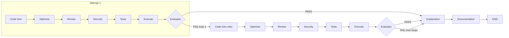
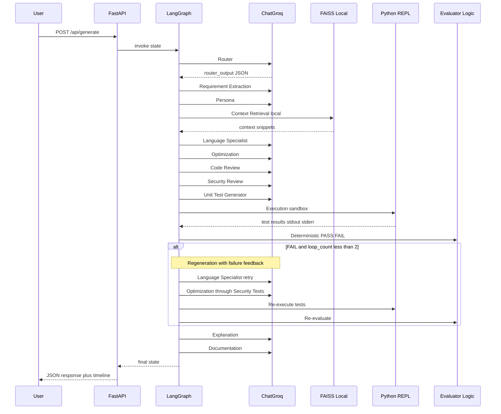
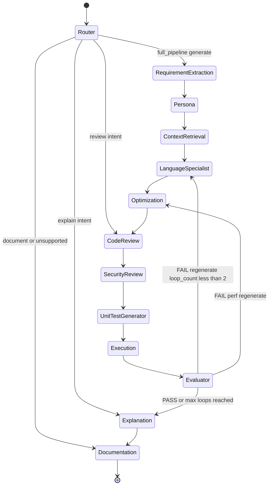
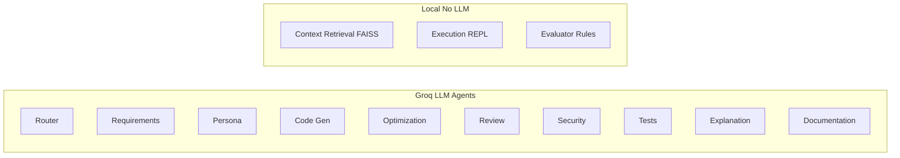

# CodeForge AI — Architecture

## System Overview

CodeForge AI is a persona-driven multi-agent software engineering platform. Natural language requests flow through a LangGraph workflow of 13 specialized agents, orchestrated by a FastAPI backend and visualized in a React dashboard.

```mermaid
flowchart TB
    subgraph frontend [React Frontend]
        UI[Dashboard]
        Monaco[Monaco Editor]
        Timeline[Agent Timeline]
        FlowViz[React Flow Graph]
        APIClient[REST Client]
    end

    subgraph api [FastAPI Backend]
        Routes["POST /api/generate"]
    end

    subgraph graph [LangGraph 13-Agent Workflow]
        R[Router]
        RE[RequirementExtraction]
        P[Persona]
        CR[ContextRetrieval]
        LS[LanguageSpecialist]
        O[Optimization]
        CRv[CodeReview]
        SR[SecurityReview]
        UT[UnitTestGenerator]
        EX[Execution]
        EV[Evaluator]
        EP[Explanation]
        DOC[Documentation]

        R --> RE
        RE --> P
        P --> CR
        CR --> LS
        LS --> O
        O --> CRv
        CRv --> SR
        SR --> UT
        UT --> EX
        EX --> EV
        EV --> EP
        EP --> DOC
        EV -->|"FAIL: loop_count less than 2"| LS
        EV -->|"perf fix"| O
    end

    subgraph services [Services Layer]
        LLM["GroqProvider llama-3.1-8b"]
        RateLimit[Rate Limiter]
        PromptLoader[Prompt Loader]
        FAISS[FAISS Retriever]
        REPL[Python REPL]
        EvalLogic[Deterministic Evaluator]
    end

    UI --> APIClient
    APIClient --> Routes
    Routes --> graph
    graph --> services
    CR --> FAISS
    EX --> REPL
    EV --> EvalLogic
    LLM --> RateLimit
```

## Regeneration Loop

When tests fail or execution errors, the **Evaluator** routes back to **Code Gen** (or **Optimization**) and re-runs the downstream pipeline. Maximum **2 regeneration attempts** (`loop_count < 2`).



## Request Lifecycle



## State Machine



## LLM vs Local Agents

Not every agent calls Groq. This reduces rate-limit pressure and speeds up the pipeline.



## Component Responsibilities

| Component | Responsibility |
|-----------|----------------|
| `backend/graph/workflow.py` | LangGraph StateGraph, intent routing, regeneration loop |
| `backend/agents/` | 13 agent node implementations |
| `backend/services/evaluation.py` | Deterministic PASS/FAIL and `should_regenerate` |
| `backend/services/rate_limiter.py` | Throttle Groq calls to prevent 429 errors |
| `backend/services/llm.py` | Groq provider with per-agent model routing |
| `backend/prompts/loader.py` | Load and inject Markdown prompt templates |
| `backend/tools/repl.py` | Sandboxed Python execution |
| `backend/tools/retriever.py` | FAISS vector retrieval |
| `backend/api/` | FastAPI REST endpoints |
| `frontend/` | React dashboard with Monaco, timeline, React Flow |

## Graph State Fields

| Field | Set By | Description |
|-------|--------|-------------|
| `request` | Initial | User natural language input |
| `router_output` | Router | Language, intent, persona, workflow |
| `requirements` | Requirement Extraction | Structured JSON requirements |
| `persona_instructions` | Persona | Persona prompt block for downstream agents |
| `retrieved_context` | Context Retrieval | FAISS snippets formatted locally |
| `generated_code` | Language Specialist | Initial code generation |
| `optimized_code` | Optimization | Best solution after comparison |
| `reviewed_code` | Code Review | Code with review fixes applied |
| `security_report` | Security Review | Security audit findings |
| `tests` | Unit Test Generator | Generated test suite |
| `execution_result` | Execution | stdout/stderr/test results |
| `evaluation` | Evaluator | PASS/FAIL, `should_regenerate`, `regenerate_agent` |
| `loop_count` | Evaluator | Regeneration attempt counter max 2 |
| `explanation` | Explanation | Algorithm walkthrough |
| `documentation` | Documentation | README, API docs, diagrams |
| `agent_timeline` | All agents | Audit trail for UI timeline |

## Rate Limiting

Groq free tier enforces request limits. CodeForge throttles calls via `LLM_REQUEST_DELAY_MS` (default 1200ms) and uses `llama-3.1-8b-instant` for all agents to stay within limits.
